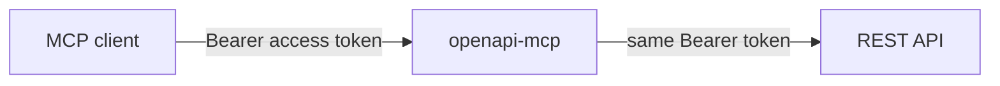

# openapi-mcp

`openapi-mcp` converts an OpenAPI 3.x document into MCP tools. It uses the
official [MCP Go SDK](https://github.com/modelcontextprotocol/go-sdk) and
serves tools over stateless Streamable HTTP.

The repository includes the iSpring Learn specification at
[`specs/rest-api.yaml`](specs/rest-api.yaml).

## Architecture



- The OpenAPI document defines MCP tool names, inputs and the upstream request.
- Each server process is stateless: it keeps no MCP session or token state.
- `OPENAPI_BASE_URL` overrides the `servers` URL from the specification.
- The `Authorization: Bearer …` header from each MCP tool call is forwarded to
  the downstream API.

The server does not validate, exchange, refresh, or persist access tokens.
Downstream authorization is performed by the target API.

### Code structure

The conversion package has one linear flow:

1. `pkg/openapi-mcp/spec.go` loads, validates, and selects curated OpenAPI operations.
2. `pkg/openapi-mcp/schema.go` builds MCP tool input schemas.
3. `pkg/openapi-mcp/profile.go` writes and validates versioned compiled profiles.
4. `pkg/openapi-mcp/register.go` registers tools using the official MCP Go SDK.
5. `pkg/openapi-mcp/request.go` builds the upstream HTTP request.
6. `pkg/openapi-mcp/http_client.go` forwards the client Bearer header.
7. `pkg/openapi-mcp/response.go` creates an MCP tool result from the HTTP response.

The CLI in `cmd/openapi-mcp` owns the stateless Streamable HTTP endpoint and profile hot reload.

## Curated tools

The iSpring specification is intentionally curated to keep MCP tool discovery
small and predictable. Its root `x-mcp-curated: true` enables opt-in mode:

- `x-mcp-enabled: true` exposes an operation as an MCP tool.
- `x-mcp-disabled: true` always excludes an operation, including in non-curated
  specifications.
- `x-mcp-read-only: true` marks a safe read-only operation even when the API
  uses `POST` for search.
- `x-mcp-base-path` replaces the path portion of the configured base URL for
  an operation that belongs to a different upstream API version.

The bundled iSpring profile exposes a focused set of read and write tools for
organization, users, learning content, enrollment, training, assignments, and
results. It omits token generation, legacy duplicates, webhooks, and specialized
performance-management endpoints.

For the common “users in a department” workflow, call `ListDepartments` to
resolve the department ID, then call `GetPagedUsersList` with
`requestBody: { "page": 1, "departments": ["<department-id>"] }`. `page`
is required by iSpring; all other body fields are optional filters. This tool
uses iSpring's `/api/v2` endpoint while the rest of the profile can use
`/api/v3`. The tool descriptions contain the same guidance for MCP clients.

Write tools require `__confirmed: true` after the user has explicitly approved
the change. The MCP server returns a confirmation request before it sends any
write request upstream.

## Requirements

- Go 1.25 or newer
- An OpenAPI 3.x YAML or JSON document
- A client capable of setting HTTP headers for remote MCP connections

## Build

```sh
git clone https://github.com/Kortasfa/openapi-mcp.git
cd openapi-mcp
make bin/openapi-mcp
```

The binary is written to `bin/openapi-mcp`.

## Production workflow

Use one binary in two modes. `compile` validates an OpenAPI source, applies its
MCP curation metadata, and writes a versioned profile. `serve` hosts that
profile over stateless Streamable HTTP.

```sh
# CI or an admin job: compile and atomically replace the profile file.
bin/openapi-mcp compile \
  --output /srv/openapi-mcp/learn.profile.json \
  specs/rest-api.yaml

# Runtime: no upstream token is configured here.
bin/openapi-mcp serve \
  --profile /srv/openapi-mcp/learn.profile.json \
  --http :8080 \
  --base-url https://test.mint.local.learn.ispringdev.com/api/v3
```

`serve` checks the profile file every two seconds and atomically activates a
valid replacement. An invalid profile is rejected and the previous profile
remains active. The MCP client connects to `http://host:8080/mcp` and supplies
its own `Authorization: Bearer <access-token>` header. `GET /health` reports
the active profile checksum and tool count.

## iSpring Learn

The bundled [`specs/rest-api.yaml`](specs/rest-api.yaml) produces 32 MCP tools
from the iSpring Learn REST API. Obtain an iSpring access token outside the MCP
server, then configure the MCP client to send it as an HTTP Bearer header. The
server forwards that header to iSpring for every API tool call.

### 1. Configure the MCP client

Use the remote server URL and configure an HTTP header in the client. The exact
syntax depends on the MCP client:

```text
MCP URL: https://mcp.example.com/mcp
HTTP header: Authorization: Bearer <iSpring access token>
```

The iSpring `Client ID` and `Client Secret` stay in the client-side secret store
or token-issuing component. They never reach this server or an MCP tool call.

### 2. Start the server

```sh
bin/openapi-mcp compile --output /srv/openapi-mcp/learn.profile.json specs/rest-api.yaml
bin/openapi-mcp serve --profile /srv/openapi-mcp/learn.profile.json --http :8080 \
  --base-url 'https://test.mint.local.learn.ispringdev.com/api/v3'
```

The server is available at `http://localhost:8080/mcp`. `OPENAPI_BASE_URL` is
important for the test environment: without its `/api/v3` suffix the API host
returns its HTML application rather than REST API responses.

### 3. Smoke-test the MCP endpoint

Use an MCP client in production. This request lists the generated tools:

```sh
curl --fail-with-body http://localhost:8080/mcp \
  --header 'Content-Type: application/json' \
  --header 'Accept: application/json, text/event-stream' \
  --header 'Authorization: Bearer <iSpring-access-token>' \
  --data '{"jsonrpc":"2.0","id":1,"method":"tools/list","params":{}}'
```

## Safety

- Treat all downstream credentials as secrets.
- Configure each MCP client to send its own access token over HTTPS.
- Put the MCP endpoint behind TLS and your product's authentication proxy.
- Review `x-mcp-enabled` annotations before compiling a production profile.
- This is transparent token forwarding, not product-level RBAC or tool filtering.
