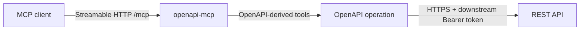

# openapi-mcp

`openapi-mcp` converts an OpenAPI 3.x document into MCP tools. It uses the
official [MCP Go SDK](https://github.com/modelcontextprotocol/go-sdk) and
serves tools over stateless Streamable HTTP.

The repository includes the iSpring Learn specification at
[`specs/rest-api.yaml`](specs/rest-api.yaml).

## Architecture



- The OpenAPI document defines MCP tool names, inputs and the upstream request.
- Each server process is stateless: it keeps no MCP session between requests.
- `OPENAPI_BASE_URL` overrides the `servers` URL from the specification.
- `BEARER_TOKEN` is sent as `Authorization: Bearer …` to the downstream API.

`BEARER_TOKEN` is currently a server-side downstream credential. It is **not**
MCP-client authorization or per-client RBAC; that gateway layer is intentionally
not implemented yet.

## Requirements

- Go 1.25 or newer
- An OpenAPI 3.x YAML or JSON document
- Credentials for the downstream API when its operations require them

## Build

```sh
git clone https://github.com/Kortasfa/openapi-mcp.git
cd openapi-mcp
make bin/openapi-mcp
```

The binary is written to `bin/openapi-mcp`.

## Run an MCP server

Start a stateless Streamable HTTP endpoint at `/mcp`:

```sh
bin/openapi-mcp --http=:8080 specs/weather.json
```

Connect an MCP client to `http://localhost:8080/mcp`. The client must send an
`Accept` header that includes both `application/json` and `text/event-stream`,
as required by the Streamable HTTP transport.

For a protected upstream API, configure its credential in the server process:

```sh
BEARER_TOKEN='downstream-access-token' \
  bin/openapi-mcp --http=:8080 specs/weather.json
```

Never place real tokens or client secrets in the repository, command history,
or MCP tool arguments.

## iSpring Learn

The bundled [`specs/rest-api.yaml`](specs/rest-api.yaml) produces 143 MCP tools
from the iSpring Learn REST API. The iSpring token endpoint is part of the
schema, but token exchange should happen outside the MCP server so that a
client secret never reaches an MCP tool call.

### 1. Obtain a short-lived downstream access token

Set the URLs for the intended environment. The test environment uses `/api/v3`
for both the token and REST API paths.

```sh
export ISPRING_TOKEN_URL='https://test.mint.local.learn.ispringdev.com/api/v3/token'
export ISPRING_API_BASE_URL='https://test.mint.local.learn.ispringdev.com/api/v3'
export ISPRING_CLIENT_ID='replace-with-client-id'
read -rs 'ISPRING_CLIENT_SECRET?iSpring client secret: '
export ISPRING_CLIENT_SECRET

export BEARER_TOKEN="$({
  curl --fail-with-body --silent --show-error --request POST "$ISPRING_TOKEN_URL" \
    --header 'Accept: application/json' \
    --header 'Content-Type: application/x-www-form-urlencoded' \
    --data-urlencode "client_id=$ISPRING_CLIENT_ID" \
    --data-urlencode "client_secret=$ISPRING_CLIENT_SECRET" \
    --data-urlencode 'grant_type=client_credentials'
} | jq --raw-output '.access_token')"

test "$BEARER_TOKEN" != 'null' && test -n "$BEARER_TOKEN"
```

This requires `curl` and `jq`. Do not export or log the returned token beyond
the process that needs it.

### 2. Start the server

```sh
OPENAPI_BASE_URL="$ISPRING_API_BASE_URL" \
  bin/openapi-mcp --http=:8080 specs/rest-api.yaml
```

The server is available at `http://localhost:8080/mcp`. `OPENAPI_BASE_URL` is
important for the test environment: without its `/api/v3` suffix the API host
returns its HTML application rather than REST API responses.

### 3. Smoke-test the MCP endpoint

Use an MCP client in production. This request lists the generated tools:

```sh
curl --fail-with-body http://localhost:8080/mcp \
  --header 'Content-Type: application/json' \
  --header 'Accept: application/json, text/event-stream' \
  --data '{"jsonrpc":"2.0","id":1,"method":"tools/list","params":{}}'
```

## CLI

```text
openapi-mcp [flags] <openapi-spec-path>
openapi-mcp [flags] validate <openapi-spec-path>
openapi-mcp [flags] lint <openapi-spec-path>
openapi-mcp [flags] filter <openapi-spec-path>
```

| Flag | Environment variable | Purpose |
| --- | --- | --- |
| `--http=:8080` | — | Serve stateless Streamable HTTP at `/mcp`. |
| `--base-url` | `OPENAPI_BASE_URL` | Override the OpenAPI server URL. |
| `--bearer-token` | `BEARER_TOKEN` | Set the downstream Bearer token. |
| `--api-key` | `API_KEY` | Set the downstream API key. |
| `--basic-auth` | `BASIC_AUTH` | Set downstream Basic credentials. |
| `--tag` | `OPENAPI_TAG` | Include operations with a tag (repeatable). |
| `--include-desc-regex` | `INCLUDE_DESC_REGEX` | Include operations matching a description. |
| `--exclude-desc-regex` | `EXCLUDE_DESC_REGEX` | Exclude operations matching a description. |
| `--dry-run` | — | Print generated tool schemas and exit. |
| `--summary` | — | Print the generated-tool summary. |
| `--doc=tools.md` | — | Generate tool documentation and exit. |

Examples:

```sh
# Check an OpenAPI document and generated tools.
bin/openapi-mcp validate specs/rest-api.yaml

# Inspect the generated tool count without starting a server.
bin/openapi-mcp --summary --dry-run specs/rest-api.yaml

# Restrict the tools exposed by a server.
bin/openapi-mcp --http=:8080 --tag=Users specs/rest-api.yaml
```

## Safety

- Treat all downstream credentials as secrets.
- Run a separate server process per downstream credential until per-client
  authorization is implemented.
- Put the MCP endpoint behind TLS and your product's authentication proxy.
- Review exposed operations with `--dry-run` or `--summary` before deployment.

## License

[MIT](LICENSE)
